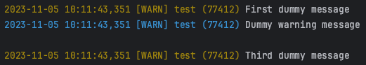

# meLogger - easy plug and play logger

## Builder

### LoggerBuilder.get_logger
Create a new logger on each call.

    name – logger name
    level – lowest logs level that will be displayed
    formats – a dict to describe the format for each log level
    terminator – end line character
    logs_path – path where logs are going be stored
    file_name – logs file name
    file_terminator – end line character for files
    file_mode – open mode - same as open(...,mode=<mode>)
    file_enc – encoding for file
    file_backups – number of replicas
    file_max_size – max size of a fil

### LoggerBuilder.setup_console_handler
Allows to add a console handler on an existing logger.

    logger - existing Logger
    level - lowest logs level that will be displayed
    formats - a dict to describe the format for each log level
    terminator - end line character
    remove_handlers - allows to delete all StreamHandler handlers 

### LoggerBuilder.setup_file_handler

Allows to add a file handler on an existing logger.

    logger - existing Logger
    file_level - lowest logs level that will be displayed
	file_formats - a dict to describe the format for each log level
	logs_path - path where logs are going be stored
	file_name - logs file name
	file_terminator - end line character for files
	file_mode - open mode - same as open(...,mode=<mode>)
	file_enc - encoding for file
	file_backups - number of replicas
	file_max_size - max size of a fil
	remove_handlers - allows to delete all StreamHandler handlers

## Logger

This is an extended class of logging.Logger that has an additional level **PLAIN** a custom ways to change the colors on each log message.

    info_green - Force next INFO log to be green
    info_color - Allows to set a color for next INFO log message
    plain - Print message without any format. Has 2 args: 
            Color - change the color for next message\n
            end - end line character override for next message

For each log message we can modify inline the color and terminator as follows:

    logger.warning("First dummy message")
    logger.warning("Dummy warning message", extra={"col_start": Colors.COL.BLUE, "end": "\n\n"})
    logger.warning("Third dummy message")

## Default Formats

    DEBUG - GREY          - "%(start)s%(col_start)s%(asctime)s [%(levelname)s] %(module)s (%(process)d) %(message)s%(col_end)s%(terminator)s"),
    INFO - DEFAULT        - "%(start)s%(col_start)s%(asctime)s [%(levelname)s] %(module)s (%(process)d)%(col_end)s %(message)s%(terminator)s"),
    WARN - YELLOW         - "%(start)s%(col_start)s%(asctime)s [%(levelname)s] %(module)s (%(process)d)%(col_end)s %(message)s%(terminator)s"),
    ERROR - RED           - "%(start)s%(col_start)s%(asctime)s [%(levelname)s] %(module)s (%(process)d)%(col_end)s %(message)s%(terminator)s"),
    CRITICAL - STRONG RED - "%(start)s%(col_start)s%(asctime)s [%(levelname)s] %(module)s (%(process)d) %(message)s%(col_end)s%(terminator)s"),
    PLAIN - DEFAULT       - "%(start)s%(col_start)s%(message)s%(col_end)s%(terminator)s")